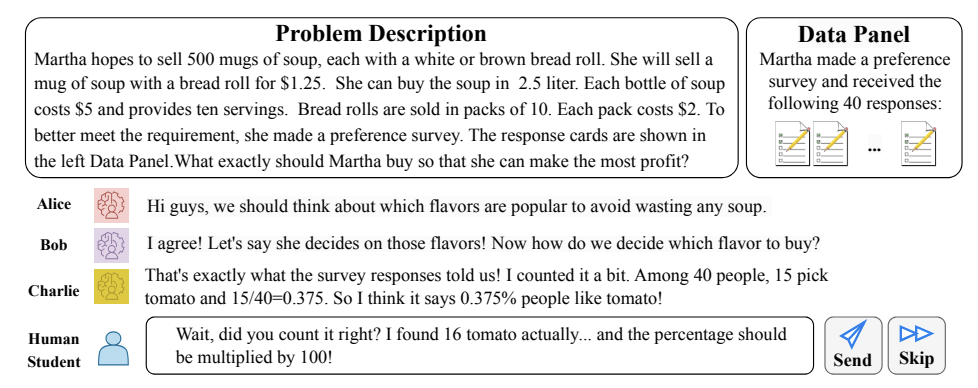

# MathVC

This repository provides code implementation for our paper [MathVC: An LLM-Simulated Multi-Character Virtual Classroom for Mathematics Education](https://arxiv.org/pdf/2404.06711.pdf). For more information, please refer to our [website](https://murongyue.github.io/MathVC.github.io/).

Please cite our paper if you find our work/code helpful!
```
@misc{yue2024mathvc,
      title={MathVC: An LLM-Simulated Multi-Character Virtual Classroom for Mathematics Education}, 
      author={Murong Yue and Wijdane Mifdal and Yixuan Zhang and Jennifer Suh and Ziyu Yao},
      year={2024},
      eprint={2404.06711},
      archivePrefix={arXiv},
      primaryClass={cs.CL}
}
```

## 1. Overview
<p align="center">

</p>
We present MathVC, the very first LLM-powered virtual classroom containing multiple LLM-simulated student characters, with whom a human student can practice their Mathematics Modeling skill. The effectiveness of the simulation approach was confirmed and the promise for MathVC to benefit real-life students in the future was shown in the paper.

An example demonstrating the application of MathVC, where students are presented a math problem (optionally with accompanied data) and engage in effective discussions on math modeling. Alice, Bob, and Charlie are LLM-simulated student characters. A human student can choose to respond or skip the current turn.

Code and demo will be released soon!